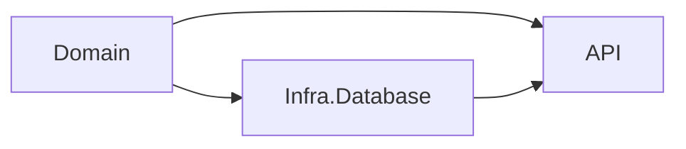

# Simple Employee Maintenance

## How to startup the project

In the root directory of this repository, do as describe below:
 1. Run the command to `docker-compose up -d` startup database in docker
 2. Run the command to install/update dotnet ef core cli: `dotnet tool install --global dotnet-ef`
 3. Run the command to apply database migrations: `dotnet ef database update --project .\SimpleEmployeeMaintenance\SimpleEmployeeMaintenance.Infra.Database\SimpleEmployeeMaintenance.Infra.Database.csproj --startup-project .\SimpleEmployeeMaintenance\SimpleEmployeeMaintenance.Api\SimpleEmployeeMaintenance.Api.csproj`
 4. Run the command to startup application: `dotnet run --project .\SimpleEmployeeMaintenance\SimpleEmployeeMaintenance.Api\SimpleEmployeeMaintenance.Api.csproj`
 5. Open any browser and navigate to `http://localhost:5081/swagger/index.html`
 6. Enjoy!

## Entity-Relationship Diagram

## Software Architecture

This application was designed as a **Layered Monolith with 3 layers**: API, Domain and Infrastructure. I used principles from **Clean Architecture** in layers separations, with **Domain** layer been the **most stable** layer and the **API** been the **most instable** layer (see diagram below). The direction of the arrow indicates which layers depend on the layer from which the arrow originates.

I also used **MediatR** to implements **CQRS**.
Talking about the **Domain layer**, I used some principles from **DDD**, this is why I designed my entities using **Value Objects** and also designed the commands and queries to use **Repository Pattern**.

In **Infra.Database**, I decided to use **Entity Framework** as a **ORM**, to manage and consume my database.

All those design decisions allow me to code the **Domain Layer** using **TDD**.