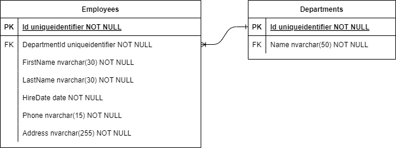

# Simple Employee Maintenance

## How to startup the project

In the root directory of this repository, do as describe below:
 1. Run the command to `docker-compose up -d` startup database in docker
 2. Run the command to install/update dotnet ef core cli: `dotnet tool install --global dotnet-ef`
 3. Run the command to apply database migrations: `dotnet ef database update --project .\SimpleEmployeeMaintenance\SimpleEmployeeMaintenance.Infra.Database\SimpleEmployeeMaintenance.Infra.Database.csproj --startup-project .\SimpleEmployeeMaintenance\SimpleEmployeeMaintenance.Api\SimpleEmployeeMaintenance.Api.csproj`
 4. Run the command to startup application: `dotnet run --project .\SimpleEmployeeMaintenance\SimpleEmployeeMaintenance.Api\SimpleEmployeeMaintenance.Api.csproj`
 5. Open any browser and navigate to `http://localhost:5081/swagger/index.html`

## Entity-Relationship Diagram
